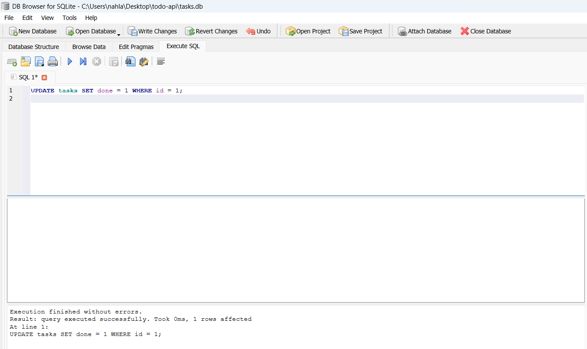
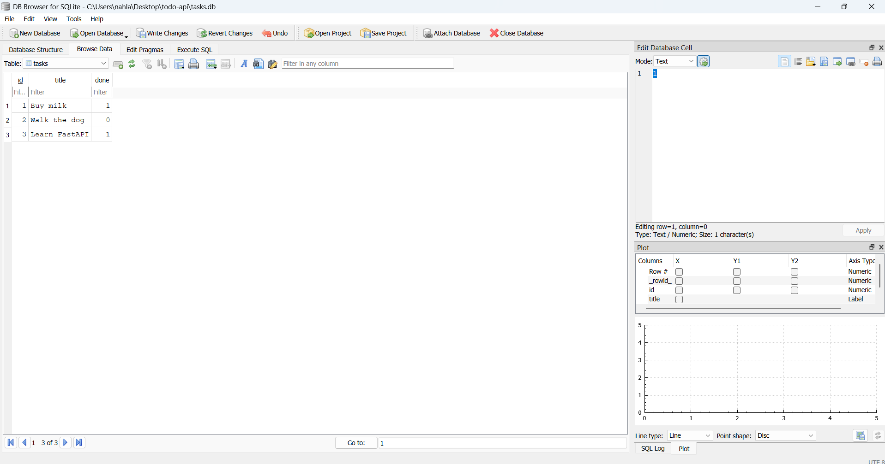

# Task API

A small CRUD API for managing a to-do list, built with FastAPI. Data is stored in a **SQLite** database (`tasks.db`), so it survives server restarts.

## Database

- **Why SQLite:** it's a single-file, serverless database — no separate service to install or run, which is exactly what a small project like this needs. The whole database is one file (`tasks.db`), and it's still the same relational SQL model you'd use with Postgres or MySQL later, so nothing here is thrown away when a project outgrows SQLite.
- **Where the file lives:** `tasks.db`, created automatically in the project root the first time the app starts. It's listed in `.gitignore`, so every fresh clone starts with an empty file that gets seeded on first run — not shared through Git.
- **How it's created:** on startup, `init_db()` (in `main.py`) runs `CREATE TABLE IF NOT EXISTS tasks (...)`, then checks `SELECT COUNT(*) FROM tasks` and inserts three example tasks only if the table is empty. Restarting the app never duplicates the seed data.
- **How queries are run:** every endpoint opens a connection with `sqlite3.connect("tasks.db")` and uses **parameterized queries** (`?` placeholders, values passed separately) for every `SELECT`/`INSERT`/`UPDATE`/`DELETE` — never string-formatted SQL — so user input can't break or inject into a query.

### Explored with DB Browser for SQLite

Opened `tasks.db` in [DB Browser for SQLite](https://sqlitebrowser.org/) and ran queries by hand in the **Execute SQL** tab, for example:

```sql
UPDATE tasks SET done = 1 WHERE id = 1;
```

This marked "Buy milk" as done directly in the database — no code involved. Calling `GET /tasks` on the running API immediately showed `"done": true` for that task, confirming the API and DB Browser read and write the exact same file.




## How to run

1. Clone this repo and enter the folder:
```bash
   git clone https://github.com/Nahla-Nabil/todo-api.git
   cd todo-api
```
2. Create and activate a virtual environment:
```bash
   python3 -m venv venv
   venv\Scripts\Activate.ps1   # Windows PowerShell
```
3. Install dependencies (SQLite support comes from Python's built-in `sqlite3` module — nothing extra to install for the database itself):
```bash
   pip install fastapi uvicorn
```
4. Start the server:
```bash
   uvicorn main:app --reload --port 8000
```
   `tasks.db` is created automatically on first run, with the `tasks` table and three example tasks seeded.
5. Open `http://localhost:8000` in your browser.

## Endpoints

| Method | Path             | Description                  |
|--------|------------------|-------------------------------|
| GET    | /                | API info                     |
| GET    | /health          | Health check                 |
| GET    | /tasks           | List all tasks                |
| GET    | /tasks/{id}      | Get a single task             |
| POST   | /tasks           | Create a new task              |
| PUT    | /tasks/{id}      | Update a task                 |
| DELETE | /tasks/{id}      | Delete a task                 |

## Example request

```bash
curl.exe -i -X POST http://localhost:8000/tasks -H "Content-Type: application/json" -d "{`"title`":`"Read a book`"}"
```

Response:
```json
{
  "id": 4,
  "title": "Read a book",
  "done": false
}
```

## Swagger UI

Interactive docs are available at `http://localhost:8000/docs`.


## AI vs me — Assignment 1 (in-memory API)

**Prompt used:**
> Build this inside the ai-version/ folder only, don't touch main.py: Build a REST API using Python and FastAPI. It needs these 5 endpoints: GET /tasks, GET /tasks/{id}, POST /tasks, PUT /tasks/{id}, and DELETE /tasks/{id}. When creating a task, return status code 201. When deleting, return status code 204. If the title is empty, return status code 400 with an error message. If a task id doesn't exist, return status code 404. Store the tasks in memory, no database needed. Also add Swagger UI documentation.

**What the AI did better:**
The AI used Pydantic's `response_model` (a `Task` schema) on every endpoint instead of returning plain dicts, which makes the Swagger docs show the exact response shape. It also factored out a shared `find_task()` helper instead of repeating the same lookup loop in every endpoint — cleaner and less repetitive than my version.

**What it got wrong or ignored:**
My prompt never mentioned `GET /` or `GET /health`, so the AI's version doesn't have them at all — it only built exactly the 5 endpoints I listed, nothing more. It also worded the validation error message differently ("title cannot be empty" vs. my "title is required") since I never specified exact wording.

**What my prompt forgot to specify — and what the AI silently decided:**
I didn't specify how new task IDs should be generated, so the AI used a global `next_id` counter starting at 4, while I had computed `max(id) + 1` dynamically. Both work, but they'd behave differently if a task were ever deleted and a new one created after. I also never asked for a Field description or an app title/description in the FastAPI() constructor — the AI added those on its own for nicer-looking docs.

**One rematch:**
I'd improve the prompt by explicitly asking for `GET /` and `/health` endpoints, and specifying that new IDs should reuse the `max(existing_ids) + 1` logic to match my original behavior exactly.

## AI vs me — Assignment 2 (SQLite migration, Stage 6)

**Prompt used:**
> Migrate the API in ai-version/main.py (the AI version from Assignment 1) from the in-memory list to SQLite. Keep everything inside ai-version/ — don't touch the root main.py. Use Python's built-in sqlite3 module (no ORM) and a file called tasks.db. On startup, create a `tasks` table if it doesn't already exist, with columns id (integer primary key), title (text), and done (boolean). Seed three example tasks — "Buy milk" (not done), "Walk the dog" (not done), "Learn FastAPI" (done) — but only if the table is empty, so restarting the app never duplicates them. Every endpoint must keep exactly the same behaviour as before: GET /tasks, GET /tasks/{id}, POST /tasks (201, or 400 if title is missing/empty), PUT /tasks/{id} (200, partial updates allowed, 404 if the id doesn't exist), DELETE /tasks/{id} (204, or 404 if the id doesn't exist). All queries must use parameterized placeholders (?) — never build SQL by pasting values into the string.

**What the AI did better:**
For `PUT`, the AI used a single `UPDATE tasks SET title = COALESCE(?, title), done = COALESCE(?, done) WHERE id = ?` query and read `cursor.rowcount` to detect a missing id. My version does a `SELECT` first to check the row exists, then a separate `UPDATE` — the AI's approach is one round trip to the database instead of two, for the same result.

**What it got wrong or ignored:**
The AI validated the create-task title only with Pydantic's `Field(..., min_length=1)`, no manual `.strip()` check. `min_length=1` blocks `""` but not whitespace like `"   "` — so `POST /tasks` with `{"title": "   "}` returned **201 Created** with a blank-looking task instead of the `400` my prompt asked for. I confirmed this by actually running the endpoint (see below); it's exactly the kind of edge case that's easy to miss when you only skim generated code instead of testing it. Interestingly, the AI *did* add a correct `.strip()` check on the `PUT` endpoint — so the same validation rule was enforced inconsistently between two endpoints of the same file.

```
$ curl -X POST /tasks -d '{"title": "   "}'
→ before fix: 201 Created  {"id": 5, "title": "   ", "done": false}
→ after fix:  400 Bad Request  {"detail": "Title cannot be empty"}
```

**What my prompt forgot to specify — and what the AI silently decided:**
I never said whether `done` should be stored as `BOOLEAN` or `INTEGER` in the `CREATE TABLE` statement — SQLite doesn't actually have a boolean type (it stores `0`/`1` either way), so the AI picked `INTEGER NOT NULL DEFAULT 0`, which is arguably the more accurate column type since it names what SQLite actually stores. I also never said anything about response docs, and the AI added a `Task` Pydantic model, a `FastAPI(title=..., description=..., version=...)` constructor, and `summary=` text on every route purely for nicer-looking `/docs` output — none of which I asked for.

**One rematch:**
I added one sentence to the prompt — *"reject titles that are empty or contain only whitespace on both POST and PUT, not just missing"* — regenerated the `create_task` validation, and it now correctly returns `400` for a whitespace-only title (shown above), matching `PUT`'s behavior.